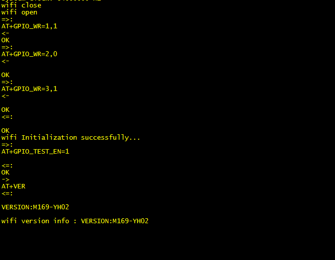

# AT Command

[](https://gitee.com/moluo-tech/AT-Command/blob/master/LICENSE)

## 简介

AT command(V2) 一款管理AT命令通信交互组件， 适用于Modem、WIFI模块、蓝牙等使用AT命令或者ASCII命令行通信的场景，它涵盖了大部分AT通信形式，如参数设置，查询，二进制数据发送等，同时也支持自定义命令交互管理，由于它的每个命令请求都是异步的，所以对于无操作系统的环境也支持。相对于V1版本，新版本在命令接收匹配，URC不定长度数据捕获以及内存安全上做了大量优化，让它可以应对更多复杂产品应用。

## 基本特性
 - 所有命令请求都是异步的，无操作系统也可以运行。
 - 支持单行命令，批量命令，可变参数命令以及自定义AT命令。
 - 支持命令响应超时，错误重传，优先级管理。
 - 支持不定长度URC(未经请求主动主报)消息捕获。
 - 支持多个AT设备通信管理。
 - 支持内存使用监视与限制。
 - 支持命令请求的生命周期管理，实时监视命令执行状态。
 - 支持命令透传

## 系统要求

为了能够使AT命令正常通信，目标系统必须满足以下要求：
- 动态内存支持。
- RAM 资源：至少 1KB (取决于接收缓冲区与URC缓冲区的设置)，建议在可分配3KB内存以上的系统中使用。
- 编译器：系统中使用了一些C99的特性(柔性数组、内联)，所以编译器需要开启对C99的支持。对于IAR，GCC它们默认是打开的，而Keil MDK需要手动增加编译选项(--c99 --gnu)。

## 新版本与V1版本区别

V1版本分成了两个模块，"at"模块仅适用于在OS环境下运行，而"at_chat"模块则适用于无操作系统的环境下运行，采用预分配内存的方式管理AT请求，不需要动态内存支持，也因为如此限制了其应用范围。虽然也可以在OS下运行，但是支持并不完善。V2版本主要是针对"at_chat"模块整体上进行优化，支持URC功能，同时也加强了对OS环境下的支持，由于使用动态内存方式管理AT命令请求，对于RAM的资源要求更高一些，但是使用上会更加便捷。

### 如何选择
如果使用的平台RAM资源(如8位单片机)有限，而且只用来做一些简单的AT通信，使用V1版本是比较合适的，而如果RAM资源充足，建议使用V2版本。

## 使用入门

下面简单介绍如何使用，4步完成:

### 1.定义适配器，完成驱动接口及缓冲区设置

```c
/**
 * @brief AT适配器
 */
static const at_adapter_t at_adapter = {
    .lock          = at_mutex_lock，           //多任务上锁(非OS下填NULL)
    .unlock        = at_mutex_unlock，         //多任务解锁(非OS下填NULL)
    .write         = at_device_write，         //串口数据写接口(非阻塞式)
    .read          = at_device_read，          //串口数据读接口(非阻塞式)
    .debug         = at_debug，                //调试打印接口(不需要则填NULL) 
    .recv_bufsize  = 256                       //接收缓冲区大小(按实际情况填写)
};
```

### 2.使用AT适配器创建AT通信对象
```c
    at_obj_t *at_obj;
    //....
    at_obj = at_obj_create(&at_adapter);
    if (at_obj == NULL) {
        printf("at object create failed\r\n");
    }  
    //...
```

### 3.加入定时轮询任务
```c
/**
 * @brief 轮询程序
 */
void at_device_process(void)
{
    static unsigned int timer;
    //为了加快AT命令处理响应速度，建议5ms以内轮询一次
    if (get_tick() - timer > 5) {
        timer = get_tick();
        at_obj_process(&at_obj);
    }    
}

```
### 4.发送AT命令

完成上面几个步骤之后，就可以执行AT命令请求了，下面以查询MODEM信号质量为例，演示如何发送AT命令及解析响应内容.

**命令格式如下:**

```shell

=>  AT+CSQ
<=  +CSQ: <rssi>，<ber>
<=  OK

```

**代码实现:**

```C

/**
 * @brief  命令响应处理程序
 */
static void csq_respose_callback(at_response_t *r)   
{
    int rssi， ber;
    //+CSQ: <rssi>，<ber>
    if (r->code == AT_RESP_OK) {
        //命令响应成功后，解析出rssi，ber.
        if (sscanf(r->prefix， "+CSQ:%d，%d"， &rssi， &ber) == 2) {
            printf("rssi:%d， ber:%d\r\n"， rssi， ber);
        }
    } else {
        printf("'CSQ' command response failed!\r\n");
    }
}  
/**
 * @brief  读CSQ值请求
 */
static void read_csq(void)
{
    //发送命令，超时时间为1000ms，重发次数为0
    at_send_singlline(at_obj， csq_respose_callback， 1000， 0， "AT+CSQ"); 
}

```
**下面是在M169 WIFI上运行的效果图(例子：`at_chat/samples/none_os`)**


## 更多案例
如果你想获取更多完整的应用案例可以参考目录'at_chat/samples'，里面提供了几个典型平台下的例子。

以Linux平台下的案例为例，可以通过终端输入以下命令运行AT通信模拟器:

```shell
    cd ./at_chat/samples/linux
    make clean & make
    ./output/demo
```

如果您使用的是vscode，直接进入samples/linux目录下，按F5开始运行。

如果程序运行正常，您将看到终端打印如下信息。

```c
*******************************************************
This is an asynchronous AT command framework.
Author:roger.luo, Mail:morro_luo@163.com
*******************************************************

Please input test item:
        1:Display memory information.
        2:Testing singlline command.
        3:Testing multiline commands.
        4:Testing variable parameter command.
        5:Testing response timeout retry.
        6:Testing response error retry.
        7:Testing command abort.
        8:Testing specific response prefix.
        9:Testing custom command.
        10:Testing buffer send.
        11:Testing 'at_do_work' 1.
        12:Testing read binary data via 'at work'.
        13:Testing capture unsolicited binary data.
        14:Testing at context interface.
*******************************************************
<=
+POWER:1
 ...
Device power on event detected!
```

根据命令行提示，输入的序号并回车就可以验证对应的用例了.


**更多详细的使用说明，请参考：**

- [介绍](http://moluo-tech.gitee.io/at-command/#/README.md)
- [快速上手](http://moluo-tech.gitee.io/at-command/#/quickStart.md)
- [高级教程](http://moluo-tech.gitee.io/at-command/#/Expert.md)
- [平台移植](http://moluo-tech.gitee.io/at-command/#/Porting.md)
- [命令解析前后缀 prefix/suffix 的作用](https://blog.csdn.net/LiaRonBob/article/details/106518930)

注意：使用时指定从设备应答的前后缀，可以避免分割数据帧，依此避免解析出现错误
