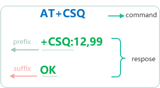

# 快速上手

有了对整个框架的基本认识之后，接下来我们看一下如何在你的平台下使用。

## 准备工作
在使用前，您需要做一些准备工作，包括：
- 工程配置与移植
- 驱动接口适配
- 创建AT通信对象
- 加入轮询任务

### 工程配置与移植

如下所示,使用前您需要先将AT通信组件添加到你的项目中, 涉及的文件只有inlcude及src这两个目录,另外根据你所有平台不同,还需要进行简单的移植配置才能正常使用,有关这部分可以参考[平台移植指南](Porting.md#平台移植)平台移植及配置.

```shell

at_chat
│
|───docs          使用文档
|───samples       演示案例
|───inlcude       头文件目录
|    │───at_chat.h
|    │───at_port.h
|    │───linux_list.h
└───src
    │───at_port.c
    │───at_chat.c    
```

### 驱动接口适配

完成平台移植这些工作之后，为了能够使AT通信对象与硬件关联起来，你需要提供相关的驱动接口进行适配对接,包括：

1. 串口读写接口
   
因为通常使用是串口进行AT通信，所以只需要提供串口中读写驱动接口即可，不过这里需要注意的是，串口驱动接口必须是带缓冲区**非阻塞**的，对于LINUX的平台，需要将串口文件IO设置为O_NONBLOCK；而如果你使用的是MCU，可以使用队列或者环形缓存区实现（死等收发不保证能正常工作)，有经验的工程师对这个应该已经比较熟悉了，对于刚入门不久的小伙，可以参考‘samples/none_os’中的例子。

2. 互斥锁接口
   
如果你是在OS环境下使用并且跨线程执行了AT请求,你需要提供上锁/解锁接口，如果你都是在单线程中运行的则直接填NULL即可。

3. 缓冲区大小设置
   
包括接收缓冲与URC缓冲区,接收缓冲区用于缓存命令请求时设备端响应的数据，它取决于你的设备最大响应内容长度;URC缓冲区也是取决于最长上报的URC数据长度。

4. 日志打印与异常接口
   
如果你需要查看所有AT命令通信的细节，你需要实现debug接口，在进行AT命令通信过程中，他会将所有收发消息输出出来，如果执行过中出现异常(出错,超时)，则可以通过实现error接口来进行监视。

完整的适配器定义如下：

```c
/**
 * @brief AT interface adapter
 */
typedef struct  {
    //Lock, used in OS environment, fill in NULL if not required.
    void (*lock)(void);
    //Unlock, used in OS environment, fill in NULL if not required.
    void (*unlock)(void);
    //Data write operation (non-blocking)
    unsigned int (*write)(const void *buf, unsigned int len); 
    //Data read operation (non-blocking)
    unsigned int (*read)(void *buf, unsigned int len);       
    //AT error event ( if not required, fill in NULL)
    void (*error)(at_response_t *);
    //Log output interface, which can print the complete AT interaction process, fill in NULL if not required.
    void (*debug)(const char *fmt, ...);  
#if AT_URC_WARCH_EN
    //URC buffer size, set according to the actual maximum URC frame when used.
    unsigned short urc_bufsize;
#endif    
    //Command response receiving buffer size, set according to the actual maximum command response length
    unsigned short recv_bufsize;
} at_adapter_t;
```

示例：
```c
/**
 * @brief AT适配器
 */
static const at_adapter_t at_adapter = {
    .lock          = at_mutex_lock,           //多任务上锁(非OS下填NULL)
    .unlock        = at_mutex_unlock,         //多任务解锁(非OS下填NULL)
    .write         = at_device_write,         //数据写接口
    .read          = at_device_read,          //数据读接口)
    .debug         = at_debug,                //调试打印接口
    .recv_bufsize  = 256,                     //接收缓冲区大小
    .urc_bufsize   = 512
};
```

### 创建AT通信对象
下一步就是使用刚刚创建好的驱动接口来创建AT通信对象。

原型如下：
```c
at_obj_t *at_obj_create(const at_adapter_t *);
```
!>  这里有一点需要特别注意,为了节省内存使用，AT组件只存储了`at_adapter_t`对象的指针，而不是对象本身，所以`at_adapter_t`定义的对象必须是常驻内存的，建议使用`const`进行修饰,这样可以存储在ROM中，减少内存使用。

示例:
```c
    at_obj_t *at_obj;
    //....
    at_obj = at_obj_create(&at_adapter);
    if (at_obj == NULL) {
        printf("at object create failed\r\n");
    }  
    //...
```
### 加入轮询任务
最后，你需要再提供一个任务定时轮询，以便它能够及时处理AT请求以及URC消息，轮询时间越短越好，原型如下：

```c
/**
 * @brief  AT轮询处理程序
 */
void at_obj_process(at_obj_t *at);
```

示例:
```c
/**
 * @brief AT轮询程序
 */
void at_device_process(void)
{
    static unsigned int timer = 0;
    //(为了加快AT命令处理响应速度,建议5ms以内轮询一次)
    if (at_get_ms() - timer > 5) {
        timer = at_get_ms();
        at_obj_process(&at_obj);  
    }
}

```
## 基础应用

完成上面几个步骤之后，你就可以使用AT命令请求相关接口了，不过在开始使用之前,我先带你了解一下有关一般AT命令格式和使用过程中涉及到的一些基本概念，了解这些有助深入理解整个AT组件是如何针对各种不同场景处理那些业务交互的实现原理。

### 一般AT命令类型与处理

以常见的GPRS/WIFI模组AT命令为例，它们常用格式的可分以下几种类型：
1. **测试命令**
命令格式为AT+&lt;x&gt;=?，用于查询设置命令设置的参数以及其取值范围。 

2. **查询命令**
命令格式为AT+&lt;x&gt;?，用于返回参数的当前值。 
3. **设置命令**
命令格式为AT+&lt;x&gt;=<...>，用于设置用户配置参数。
4. **执行命令**
命令格式为AT+&lt;x&gt;，不带参数，常用于执行系统相关操作，如查询系统信息，读取IMEI号等。

上面列举的4种格式基本上覆盖了常见AT通信场景，通信双方都是一问一答式的，主机发送1行命令请求，从机响应数据及状态，双方只交互一次。由于流程结构一样，所以在软件设计时比较容易统一设计成一种类型接口。

```shell
主机：
            => AT+XXX...
从机：
            <= +XXX
            <= OK/ERROR
```

对主机端来说，命令都是以行为单位执行的,只是携带的参数类型或者个数不同，唯一需要特殊处理的是数据响应信息解析，因为各个命令响应并没有统一格式，所以无法在底层实现一个通用解析模块，这需要上层应用根据不同的命令类型进行分别处理。我们可以按照谁发的命令谁来处理的原则，将命令响应内容返还给命令发送者，由它来进行处理。但是在此之前，需要鉴别响应内容从哪开始到哪结束，这就涉及到内容匹配提取的问题，归纳起来如有下两种情况：
- 对于设置类命令，命令响应全是以"OK"状态返回。
- 对于查询类命令，返回的内容包含数据+状态，命令状态也是以"OK"返回，而数据部分对于不同命令有不一样的信息格式。

由此可以通过统一为匹配"前缀+后缀"的方式提取到AT命令响应的内容，这也是这个组件处理AT命令请求的基本实现原理，它通过可以为每个命令附带一个属性信息(包含响应前缀，响应后缀)用于告诉AT解析器如何正确提取响应的内容。

以无线模组查询信号质量命令为例，如下图所示,"+CSQ:"作为响应内容前缀,"OK"作为响应内容后缀。



### 命令属性

AT命令属性使用**at_attr_t**描述，在发送AT请求之前，你可以为每个AT请求设置一个属性，它可以控制AT状态机的行为，如控制命令响应内容匹配规则、超时时间、错误重试等。所有AT作业对象都共享以下属性:

- 用户私有参数(params)
- 响应内容前后缀(prefix,suffix)
- 回调处理程序(cb)
- 响应超时时间(timeout)
- 重次次数(retry)
- 优先级(priority)

**AT属性数据结构定义如下:**

```c

/**
 *@brief AT Command attributes.
 */
typedef struct {
    void          *params;       /* User parameter, fill in NULL if not required. */
    const char    *prefix;       /* Response prefix, fill in NULL if not required. */ 
    const char    *suffix;       /* Response suffix, fill in NULL if not required. */
    at_callback_t  cb;           /* Response callback handler, fill in NULL if not needed. */
    unsigned short timeout;      /* Response timeout(ms). */
    unsigned char  retry;        /* Response error retries. */
    at_cmd_priority priority;    /* Command execution priority. */
} at_attr_t;

```

在使用AT属性之前，你需要为它的每个字段都进行初始化设置,但每次发送请求都将所有属性设置一遍太过繁琐，大多数情况下命令的属性都差不多，您可以先使用**at_attr_deinit**进行默认设置，然后再设置关注的属性即可。

**示例1:**
```c
at_attr_t attr;
//设置属性为默认值
at_attr_deinit(&attr);        
attr.cb = my_handler;   //设置回调处理程序
```
**示例2:**
```c
at_attr_t attr;
//设置属性为默认值
at_attr_deinit(&attr);        
attr.cb = my_handler;   //设置回调处理程序
attr.prefix = "+CSQ:"   //设置响应内容前缀
attr.suffix = "OK";     //设置响应内容后缀
...

```
### AT回调与响应

对于是异步的命令，所有请求的结果都是通过回调方式通知应用程序的，同时它会返回命令响应的相关信息，你可以在AT属性中指定相应的回调处理程序。

**回调程序原型如下:**

```c
/**
 *@brief AT  执行回调
 *@param r   AT响应信息(包含执行结果，设备端返回的内容信息)
 */
typedef void (*at_callback_t)(at_response_t *r);  
```
其中`at_response_t`包含了所有请求响应相关的信息，它包含了请求命令的执行状态和命令响应内容。
```c
/**
 * @brief AT响应信息
 */
typedef struct {
    struct at_obj  *obj;                                    /* 所属AT通信对象*/   
    void           *params;                                 /* 附属参数*/	
    at_resp_code    code;                                   /* AT命令响应码*/    
    unsigned short  recvcnt;                                /* 接收数据长度*/    
    char           *recvbuf;                                /* 接收缓冲区(原始数据)*/
    /* 接收内容前缀，当code=AT_RESP_OK时有效，如果未指定匹配前缀则它指向recvbuf*/
    char           *prefix;      
    /* 接收内容后缀，当code=AT_RESP_OK时有效，如果未指定匹配后缀则它指向recvbuf*/
    char           *suffix;
} at_response_t;

```
- obj:所属AT通信对象，你可以通过它在响应处理程序中根据状态发送下一个请求。
- param:附属参数，对应`at_attr_t`中的params。
- code:AT命令响应码
- recvcnt:指示了接收缓冲区recvbuf有效接收数据长度。
- recvbuf:缓存了此次命令请求时返回的数据。
- prefix:接收内容前缀，例如当你期望接收到'+CSQ:'开始的数据时，当code==AT_RESP_OK，则prefix就是指向了'recvbuf'中'+CSQ:'的开始位置。
- suffix:接收内容后缀。


了解完上面的几个基本概念之后，下面看一下如何使用。

### 单行命令发送(at_send_singlline)
通过`at_send_singlline`函数可以执行单行命令请求，其原型如下：

```c
/**
 * @brief   Send a single -line command
 * @param   cb        Response callback handler， Fill in NULL if not required
 * @param   timeout   command execution timeout(ms)
 * @param   retry     command retries( >= 0)
 * @param   singlline command
 * @retval  Indicates whether the asynchronous work was enqueued successfully.
 * @note    Only the address is saved， so the 'singlline' can not be a local variable which will be destroyed.
 */
bool at_send_singlline(at_obj_t *at, at_callback_t cb, int timeout, int retry, const char *singlline);
```
**返回值:**
当请求成功返回true，否则返回false。

**参数说明:**

- at : AT对象
- cb : 回调处理程序，当命令执行完成之后，将以这个接口通知上层应用，并携带命令响应内容及状态。
- timeout：命令执行超时时间，单位为ms。
- retry：命令出错或者超时重试次数。
- singlline：命令名称。

>注:AT作业只会缓存singlline的指针，这意味者它指向的命令不能是局部数据。

**示例1，查询网络注册状态(SIM900模块):**

命令格式：

```c
=> AT+CREG?

<= +CREG:<mode>,<stat>[,< lac>,< ci>]

<= OK
```
代码实现：
```c
/**
 * @brief  命令响应处理程序
 */
static void read_creg_callback(at_response_t *r)   
{
    int mode, state;
    if (r->code == AT_RESP_OK) {
        //提取出工作模式及注册状态
        if (sscanf(r->prefix, "+CREG:%d,%d", &mode, &state) == 2) {
            printf("Mode:%d, state:%d\r\n", mode, state);
        }
    } else {
        printf("'CREG' command response failed!\r\n");
    }
}

/**
 * @brief  读网络注册状态
 */
static void read_creg(void)
{
    //发送CREG查询命令,超时时间为1000ms,重发次数为0
    at_send_singlline(at_obj, read_creg_callback, 500, 1, "AT+CREG?"); 
}
```

**示例2,IO控制:**

如果你不关心命令响应结果，直接可以这样使用。
```c
at_send_singlline(at_obj, NULL, 500, 0, "AT+SETIO=1,FF");   //设置设备IO类型
at_send_singlline(at_obj, NULL, 500, 0, "AT+OUTIO=1,55");   //设置IO电平
```

### 多行命令发送(at_send_multiline)
实际工程应用中,特别是进行设备初始化配置时，往往一次需要发送大量命令，一种实现方式是通过`at_send_singlline`在每个命令的回调中根据命令状态进行下一条命令的请求，命令较少时还可以接受，命令一多就会形成恐怖的回调地狱链，造成代码难以理解和维护，现实中应尽量避免这种写法。这里提供了一个支持批量发送的接口来应对这种情况，其原型如下：
```c

/**
 * @brief   Send multiline commands
 * @param   attr AT attributes(NULL to use the default value)
 * @param   multiline Command table, with the last item ending in NULL.
 * @example :
 *          const char *multiline = {
 *              "AT+XXX",
 *              "AT+XXX",
 *              NULL
 *          };
 *          at_send_multiline(at_dev, NULL, multiline);
 * 
 * @retval  Indicates whether the asynchronous work was enqueued successfully.
 * @note    Only the address is saved, so the array can not be a local variable which will be destroyed.
 */
bool at_send_multiline(at_obj_t *at, const at_attr_t *attr, const char **multiline);
```
**返回值:**
当请求成功返回true，否则返回false。

**参数说明:**

- at : AT对象
- attr : 命令属性，通过它可以设置命令回调程序，超时时间等。
- multiline：命令表，以NULL结尾。

**示例（SIM800C 模组初始化）:**

```c
/**
 * @brief  命令响应处理程序
 */
static void simcom_init_callback(at_response_t *r)   
{
    printf("SIM800C Init %s!\r\n",r->code == AT_RESP_OK ? "ok" : "error");
}
/* 
 * @brief 模块初始化
 */
static void simcom_init(void)
{
    at_attr_t attr;
    static const char *cmds[] = {
    "AT+CSCLK=0",                                              
    "AT+CIPHEAD=1",                                             //+RECEIVE,<n>,<data length>:
    "AT+CIPQSEND=1",                                            //快发模式
    "AT+CIPMUX=1",                                              //多IP支持
    "AT+CIPSPRT=>",
    "AT+CIPSRIP=0",         
    NULL
    };
    at_attr_deinit(&attr);
    attr.cb = simcom_init_callback;                             //设置命令回调
    at_send_multiline(at_obj, &attr, cmds);
}
```
!> 批量命令表中最后一项必须是NULL，且整个命令表不能是局部变量。
### 可变参数命令(at_exec_cmd)
前面讲的单行命令与多行命令都是用于发送固定参数的命令的，如果你的命令参数（如设置类命令）是可变的，可以通过 `at_exec_cmd`执行请求，其原型如下：

```c
/**
 * @brief   Execute one command
 * @param   attr AT attributes(NULL to use the default value)
 * @param   cmd  Formatted arguments
 * @param   ...  Variable argument list (same usage as printf)
 * @retval  Indicates whether the asynchronous work was enqueued successfully
 */
bool at_exec_cmd(at_obj_t *at, const at_attr_t *attr, const char *cmd, ...);
```
**返回值:**
当请求成功返回true，否则返回false。

**参数说明:**

- at : AT对象
- attr : 命令属性，通过它可以设置命令回调程序，超时时间等。
- cmd : 格式化命令，用法与printf一样。
  
**示例1,EC20设置APN:**

```c
/**
 * @brief  命令响应处理程序
 */
static void set_apn_callback(at_response_t *r)   
{
    printf("Setting APN %s!\r\n",r->code == AT_RESP_OK ? "ok" : "error");
}
/** 
 * @brief 设置APN
 */
static bool set_apn(const char *apn, const char *username, const char *pwd)
{
    at_attr_t attr;
    at_attr_deinit(&attr);      
    attr.cb = set_apn_callback; //设置命令回调
    at_exec_cmd(at_obj, &attr, "AT+QICSGP=1,1,\"%s\",\"%s\",\"%s\",0", apn, username, pwd);
}
```
### 可变参数列表(at_exec_vcmd)
通常`at_obj_t`对象并不会直接公开给第第三方模块使用，为了能够使其它模块也能进行AT请求，你可能需要对命令请求的接口进行2次封装，当需要支持可变参数时，可以使用`at_exec_vcmd`，它支持传递变参列表，其原型如下：
```c
/**
 * @brief   execute command (with variable argument list)
 * @param   attr AT attributes(NULL to use the default value)
 * @param   cmd  Format the command.
 * @param   va   Variable parameter list
 * @return  Indicates whether the asynchronous work was enqueued successfully
 */
bool at_exec_vcmd(at_obj_t *at, const at_attr_t *attr, const char *cmd, va_list va);
```
**返回值:**
当请求成功返回true，否则返回false。

**参数说明:**

- at   : AT对象
- attr : 命令属性，通过它可以设置命令回调程序，超时时间等。
- cmd  : 格式化命令
- va   : 参数列表
   
**示例:**
```c
/** 
 * @brief 发送AT命令
 * @param   attr 命令属性
 * @param   cmd,.. 格式化命令参数，用法与printf一样
 */
bool at_send_cmd(const at_attr_t *attr, const char *cmd, ...)
{
    bool ret;
    va_list args;
    va_start(args, cmd);
    ret = at_exec_vcmd(at_obj, attr, cmd, args);
    va_end(args); 
    return ret;       
}
```
### 发送原始数据(at_send_data)
当命令类型非纯文本或者格式化的命令无法满足要求时，可以使用`at_send_data`接口，以原始数据的方式发送。
```c
/**
 * @brief   Send (binary) data
 * @param   attr AT attributes(NULL to use the default value)
 * @param   databuf Binary data
 * @param   bufsize Binary data length
 * @retval  Indicates whether the asynchronous work was enqueued successfully
 */
bool at_send_data(at_obj_t *at, const at_attr_t *attr, const void *databuf, unsigned int bufsize);
```
**返回值:**
当请求成功返回true，否则返回false。

**参数说明:**
- at   : AT对象
- attr : 命令属性，通过它可以设置命令回调程序，超时时间等。
- databuf  : 原始数据
- bufsize   : 数据长度

### 自定义命令(at_custom_cmd)
在进行变参命令或者原始数据发送时，系统会他们单独分配一块区域进行暂存，然后跟随AT作业一块缓存到队列中，如果短期需要发送大量的数据，或者命令队列不能及时被处理，那么那段时间内命令队列占用的总内存会激增，严重时导致无可用内存。即使在内存使用的上做限制，但是遇到这种情况也会造成命令请求失败，使用自定义命令的方式可以在一定程度缓解这个问题，它不直接缓存调用者的任何数据，而只暂存一个发送器指针，当真正发送命令时，再上调用者请求数据，其原型如下：

```c
/**
 * @brief   Execute custom command
 * @param   attr AT attributes(NULL to use the default value)
 * @param   sender Command sending handler (such as sending any type of data through the env->obj->adap-write interface)
 * @retval  Indicates whether the asynchronous work was enqueued successfully
 */
bool at_custom_cmd(at_obj_t *at, const at_attr_t *attr, void (*sender)(at_env_t *env));
```

**返回值:**
当请求成功返回true，否则返回false。

**参数说明:**
- at   : AT对象
- attr : 命令属性，通过它可以设置命令回调程序，超时时间等。
- sender  : 数据发送器，调用者可以通过env->obj->write接口发送任何形式的数据。

**示例:(ESP8266创建TCP socket)**

```c
/**
 * @brief  命令响应处理程序
 */
static void create_socket_callback(at_response_t *r)   
{
    printf("Create socket %s!\r\n",r->code == AT_RESP_OK ? "ok" : "error");
}
/** 
 * @brief 发送创建socket命令
 */
void create_socket_sender(at_env_t *env)
{
    socket_t *sock = (socket_t *)env->params;
    env->println(env, "AT+CIPSTART=\"TCP\",\"%s\",%d", sock->ip, sock->port);
}

/** 
 * @brief 创建socket
 */
static bool create_socket(socket_t *sock)
{
    at_attr_t attr;
    at_attr_deinit(&attr);   
    attr.params = sock;                   //用户参数(里面存储了socket id,目标IP，端口)
    attr.cb     = create_socket_callback; //设置命令回调
    attr.suffix = "CONNECT OK";           //设置响应后缀
    return at_custom_cmd(at_obj, &attr, create_socket_sender);
}

```
