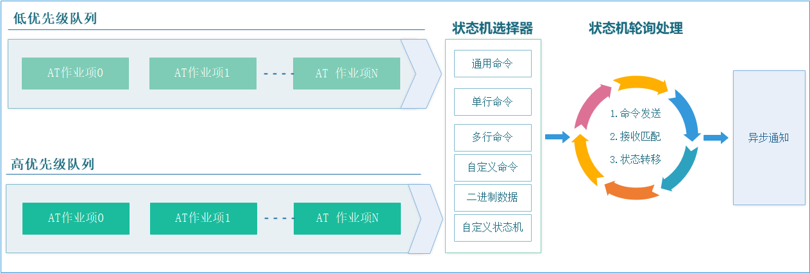
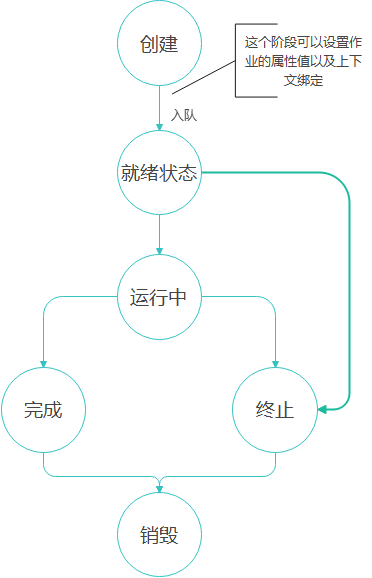
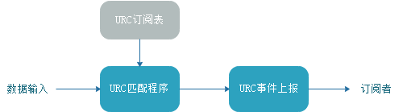
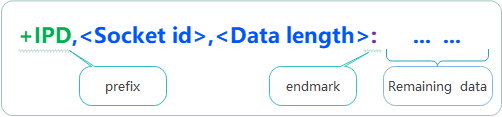

# 简介

AT command(V2) 是一款管理AT命令通信交互的组件， 适用于Modem、WIFI、蓝牙等使用AT命令或者ASCII命令行通信的场景，它涵盖了大部分AT通信形式，如参数设置、查询、二进制数据发送等，同时也支持自定义命令交互管理，由于它的每个命令请求都是异步的，所以对于无操作系统的环境也支持。相对于V1版本，新版本在命令接收匹配、URC不定长度数据捕获以及内存安全上做了大量优化，让它可以应对更多复杂的应用。

下面是一个最基本使用的演示：
```c
/**
 * @brief  命令响应处理程序
 */
static void read_csq_callback(at_response_t *r)   
{
    int rssi, ber;
    //+CSQ: <rssi>,<ber>
    if (r->code == AT_RESP_OK) {
        //命令响应成功后,解析出rssi,ber.
        if (sscanf(r->prefix, "+CSQ:%d,%d", &rssi, &ber) == 2) {
            printf("rssi:%d, ber:%d\r\n", rssi, ber);
        }
    } else {
        printf("'CSQ' command response failed!\r\n");
    }
}

/**
 * @brief  读CSQ值请求
 */
static void read_csq(void)
{
    //发送CSQ查询命令,超时时间为1000ms,重发次数为0
    at_send_singlline(at_obj, read_csq_callback, 1000, 0, "AT+CSQ"); 
}
```

上面的示例展示了AT命令通信的基本使用方式：
- 命令请求：执行命令发送之后,命令并不会立即从数据通道发送出去,而是先进入命令队列。
- 异步通知：无论命令执行成功与否,都会以异步方式通知请求者。


# 框架介绍
整个组件由两部分内容组成:
- AT 作业管理, 管理所有AT异步请求及命令收发工作。
- URC(主动上报) 处理模块,实时捕获URC消息并上报事件,它跟AT作业是并行的,是一个可选的模块。

## AT 作业

'AT Command'整个组件基本处理单元是AT作业, 它实际上是一个有限状态机，不仅仅可以处理单个命令收发，还可以是批量命令，自定义命令等,应用程序在进行AT通信请求时，系统会根据请求类型生成一个新的作业对象，然后将对象按照执行优先级预先缓存到队列中，接着系统会从队列逐个取出并选择相应的状态机处理程序进行处理，处理完毕之后再以回调方式将结果上报给应用程序，整个环节跟流水作业生产产品一样，它的基本处理流程图如下所示：



### AT作业生命周期

AT作业生命周期可以简单分为五个阶段：创建阶段、就绪阶段、运行阶段、完成/终止阶段、销毁阶段。



- **创建阶段:** 根据请求类型生成作业项,这个阶段可以为新作业项绑定一个上下文,用来监视作业的整个工作过程,包含运行状态,AT命令响应信息等.
- **就绪阶段:** 作业被提交入队列之后就进入了就绪状态,系统按队列顺序一个接着一个取出来并运行.
- **运行阶段:** 此时进入运行一个状态机,以一般AT命令为例,它包含了命令发送,数据接收匹配,超时重试等处理.
- **完成/终止阶段:** 当命令请求的响应信息匹配成功之后,则进入完成状态,如果在这之前命令请求被提示终止，则进入终止状态。
- **销毁阶段:** 在这个阶段系统会将作业从队列中移出同时将相关内存释放.

## URC 处理模块

URC 处理模块可以实时解析URC消息,上层应用需要提供URC消息的匹配规则(消息前后缀)及事件处理入口,它们共同组成了URC订阅表,一旦URC解析器匹配到表中某项规则时,立即以事件方式返回给订阅者进行处理(有关这部分的使用可以参考[URC订阅](../docs/Porting.md))。



# 快速上手

有了对整个框架的基本认识之后，接下来我们看一下如何在你的平台下使用。

## 准备工作
在使用前，您需要做一些准备工作，包括：
- 工程配置与移植
- 驱动接口适配
- 创建AT通信对象
- 加入轮询任务

### 工程配置与移植

如下所示,使用前您需要先将AT通信组件添加到你的项目中, 涉及的文件只有inlcude及src这两个目录,另外根据你所有平台不同,还需要进行简单的移植配置才能正常使用,有关这部分可以参考[平台移植指南](../docs/Porting.md)平台移植及配置.

```shell

at_chat
│
|───docs          使用文档
|───samples       演示案例
|───inlcude       头文件目录
|    │───at_chat.h
|    │───at_port.h
|    │───linux_list.h
└───src
    │───at_port.c
    │───at_chat.c    
```

### 驱动接口适配

完成平台移植这些工作之后，为了能够使AT通信对象与硬件关联起来，你需要提供相关的驱动接口进行适配对接,包括：

1. 串口读写接口
   

因为通常使用是串口进行AT通信，所以只需要提供串口中读写驱动接口即可，不过这里需要注意的是，串口驱动接口必须是带缓冲区**非阻塞**的，对于LINUX的平台，需要将串口文件IO设置为O_NONBLOCK；而如果你使用的是MCU，可以使用队列或者环形缓存区实现（死等收发不保证能正常工作)，有经验的工程师对这个应该已经比较熟悉了，对于刚入门不久的小伙，可以参考‘samples/none_os’中的例子。

2. 互斥锁接口
   

如果你是在OS环境下使用并且跨线程执行了AT请求,你需要提供上锁/解锁接口，如果你都是在单线程中运行的则直接填NULL即可。

3. 缓冲区大小设置
   

包括接收缓冲与URC缓冲区,接收缓冲区用于缓存命令请求时设备端响应的数据，它取决于你的设备最大响应内容长度;URC缓冲区也是取决于最长上报的URC数据长度。

4. 日志打印与异常接口
   

如果你需要查看所有AT命令通信的细节，你需要实现debug接口，在进行AT命令通信过程中，他会将所有收发消息输出出来，如果执行过中出现异常(出错,超时)，则可以通过实现error接口来进行监视。

完整的适配器定义如下：

```c
/**
 * @brief AT interface adapter
 */
typedef struct  {
    //Lock, used in OS environment, fill in NULL if not required.
    void (*lock)(void);
    //Unlock, used in OS environment, fill in NULL if not required.
    void (*unlock)(void);
    //Data write operation (non-blocking)
    unsigned int (*write)(const void *buf, unsigned int len); 
    //Data read operation (non-blocking)
    unsigned int (*read)(void *buf, unsigned int len);       
    //AT error event ( if not required, fill in NULL)
    void (*error)(at_response_t *);
    //Log output interface, which can print the complete AT interaction process, fill in NULL if not required.
    void (*debug)(const char *fmt, ...);  
#if AT_URC_WARCH_EN
    //URC buffer size, set according to the actual maximum URC frame when used.
    unsigned short urc_bufsize;
#endif    
    //Command response receiving buffer size, set according to the actual maximum command response length
    unsigned short recv_bufsize;
} at_adapter_t;
```

示例：
```c
/**
 * @brief AT适配器
 */
static const at_adapter_t at_adapter = {
    .lock          = at_mutex_lock,           //多任务上锁(非OS下填NULL)
    .unlock        = at_mutex_unlock,         //多任务解锁(非OS下填NULL)
    .write         = at_device_write,         //数据写接口
    .read          = at_device_read,          //数据读接口)
    .debug         = at_debug,                //调试打印接口
    .recv_bufsize  = 256,                     //接收缓冲区大小
    .urc_bufsize   = 512
};
```

### 创建AT通信对象
下一步就是使用刚刚创建好的驱动接口来创建AT通信对象。

原型如下：
```c
at_obj_t *at_obj_create(const at_adapter_t *);
```
!>  这里有一点需要特别注意,为了节省内存使用，AT组件只存储了'at_adapter_t'对象的指针，而不是对象本身，所以'at_adapter_t'定义的对象必须是常驻内存的，建议使用const进行修饰,这样可以存储在ROM中，减少内存使用。

示例:
```c
    at_obj_t *at_obj;
    //....
    at_obj = at_obj_create(&at_adapter);
    if (at_obj == NULL) {
        printf("at object create failed\r\n");
    }  
    //...
```
### 加入轮询任务
最后，你需要再提供一个任务定时轮询，以便它能够及时处理AT请求以及URC消息，轮询时间越短越好，原型如下：

```c
/**
 * @brief  AT轮询处理程序
 */
void at_obj_process(at_obj_t *at);
```

示例:
```c
/**
 * @brief AT轮询程序
 */
void at_device_process(void)
{
    static unsigned int timer = 0;
    //(为了加快AT命令处理响应速度,建议5ms以内轮询一次)
    if (at_get_ms() - timer > 5) {
        timer = at_get_ms();
        at_obj_process(&at_obj);  
    }
}

```
## 基础应用

完成上面几个步骤之后，你就可以使用AT命令请求相关接口了，不过在开始使用之前,我先带你了解一下有关一般AT命令格式和使用过程中涉及到的一些基本概念，了解这些有助深入理解整个AT组件是如何针对各种不同场景处理那些业务交互的实现原理。

### 一般AT命令类型与处理

以常见的GPRS/WIFI模组AT命令为例，它们常用格式的可分以下几种类型：
1. **测试命令**
命令格式为AT+&lt;x&gt;=?，用于查询设置命令设置的参数以及其取值范围。 

2. **查询命令**
命令格式为AT+&lt;x&gt;?，用于返回参数的当前值。 
3. **设置命令**
命令格式为AT+&lt;x&gt;=<...>，用于设置用户配置参数。
4. **执行命令**
命令格式为AT+&lt;x&gt;，不带参数，常用于执行系统相关操作，如查询系统信息，读取IMEI号等。

上面列举的4种格式基本上覆盖了常见AT通信场景，通信双方都是一问一答式的，主机发送1行命令请求，从机响应数据及状态，双方只交互一次。由于流程结构一样，所以在软件设计时比较容易统一设计成一种类型接口。

```shell
主机：
            => AT+XXX...
从机：
            <= +XXX
            <= OK/ERROR
```

对主机端来说，命令都是以行为单位执行的,只是携带的参数类型或者个数不同，唯一需要特殊处理的是数据响应信息解析，因为各个命令响应并没有统一格式，所以无法在底层实现一个通用解析模块，这需要上层应用根据不同的命令类型进行分别处理。我们可以按照谁发的命令谁来处理的原则，将命令响应内容返还给命令发送者，由它来进行处理。但是在此之前，需要鉴别响应内容从哪开始到哪结束，这就涉及到内容匹配提取的问题，归纳起来如有下两种情况：
- 对于设置类命令，命令响应全是以"OK"状态返回。
- 对于查询类命令，返回的内容包含数据+状态，命令状态也是以"OK"返回，而数据部分对于不同命令有不一样的信息格式。

由此可以通过统一为匹配"前缀+后缀"的方式提取到AT命令响应的内容,这也是这个组件处理AT命令请求的基本实现原理,它通过可以为每个命令附带一个属性信息(包含响应前缀，响应后缀)用于告诉AT解析器如何正确提取响应的内容。

以无线模组查询信号质量命令为例，如下图所示,"+CSQ:"作为响应内容前缀,"OK"作为响应内容后缀。


### 命令属性

AT命令属性使用**at_attr_t**描述，在发送AT请求之前，你可以为每个AT请求设置一个属性，它可以控制AT状态机的行为，如控制命令响应内容匹配规则、超时时间、错误重试等。所有AT作业对象都共享以下属性:

- 用户私有参数(params)
- 响应内容前后缀(prefix,suffix)
- 回调处理程序(cb)
- 响应超时时间(timeout)
- 重次次数(retry)
- 优先级(priority)

**AT属性数据结构定义如下:**

```c

/**
 *@brief AT Command attributes.
 */
typedef struct {
    void          *params;       /* User parameter, fill in NULL if not required. */
    const char    *prefix;       /* Response prefix, fill in NULL if not required. */ 
    const char    *suffix;       /* Response suffix, fill in NULL if not required. */
    at_callback_t  cb;           /* Response callback handler, fill in NULL if not needed. */
    unsigned short timeout;      /* Response timeout(ms). */
    unsigned char  retry;        /* Response error retries. */
    at_cmd_priority priority;    /* Command execution priority. */
} at_attr_t;

```

在使用AT属性之前，你需要为它的每个字段都进行初始化设置,但每次发送请求都将所有属性设置一遍太过繁琐，大多数情况下命令的属性都差不多，您可以先使用**at_attr_deinit**进行默认设置，然后再设置关注的属性即可。

**示例1:**
```c
at_attr_t attr;
//设置属性为默认值
at_attr_deinit(&attr);        
attr.cb = my_handler;   //设置回调处理程序
```
**示例2:**
```c
at_attr_t attr;
//设置属性为默认值
at_attr_deinit(&attr);        
attr.cb = my_handler;   //设置回调处理程序
attr.prefix = "+CSQ:"   //设置响应内容前缀
attr.suffix = "OK";     //设置响应内容后缀
...

```
### AT回调与响应

对于是异步的命令，所有请求的结果都是通过回调方式通知应用程序的，同时它会返回命令响应的相关信息，你可以在AT属性中指定相应的回调处理程序。

**回调程序原型如下:**

```c
/**
 *@brief AT  执行回调
 *@param r   AT响应信息(包含执行结果，设备端返回的内容信息)
 */
typedef void (*at_callback_t)(at_response_t *r);  
```
其中`at_response_t`包含了所有请求响应相关的信息，它包含了请求命令的执行状态和命令响应内容。
```c
/**
 * @brief AT响应信息
 */
typedef struct {
    struct at_obj  *obj;                                    /* 所属AT通信对象*/   
    void           *params;                                 /* 附属参数*/	
    at_resp_code    code;                                   /* AT命令响应码*/    
    unsigned short  recvcnt;                                /* 接收数据长度*/    
    char           *recvbuf;                                /* 接收缓冲区(原始数据)*/
    /* 接收内容前缀，当code=AT_RESP_OK时有效，如果未指定匹配前缀则它指向recvbuf*/
    char           *prefix;      
    /* 接收内容后缀，当code=AT_RESP_OK时有效，如果未指定匹配后缀则它指向recvbuf*/
    char           *suffix;
} at_response_t;

```
- obj:所属AT通信对象，你可以通过它在响应处理程序中根据状态发送下一个请求。
- param:附属参数，对应`at_attr_t`中的params。
- code:AT命令响应码
- recvcnt:指示了接收缓冲区recvbuf有效接收数据长度。
- recvbuf:缓存了此次命令请求时返回的数据。
- prefix:接收内容前缀，例如当你期望接收到'+CSQ:'开始的数据时，当code==AT_RESP_OK，则prefix就是指向了'recvbuf'中'+CSQ:'的开始位置。
- suffix:接收内容后缀。


了解完上面的几个基本概念之后，下面看一下如何使用。

### 单行命令发送(at_send_singlline)
通过`at_send_singlline`函数可以执行单行命令请求，其原型如下：

```c
/**
 * @brief   Send a single -line command
 * @param   cb        Response callback handler， Fill in NULL if not required
 * @param   timeout   command execution timeout(ms)
 * @param   retry     command retries( >= 0)
 * @param   singlline command
 * @retval  Indicates whether the asynchronous work was enqueued successfully.
 * @note    Only the address is saved， so the 'singlline' can not be a local variable which will be destroyed.
 */
bool at_send_singlline(at_obj_t *at, at_callback_t cb, int timeout, int retry, const char *singlline);
```
**返回值:**
当请求成功返回true，否则返回false。

**参数说明:**

- at : AT对象
- cb : 回调处理程序，当命令执行完成之后，将以这个接口通知上层应用，并携带命令响应内容及状态。
- timeout：命令执行超时时间，单位为ms。
- retry：命令出错或者超时重试次数。
- singlline：命令名称。

>注:AT作业只会缓存singlline的指针，这意味者它指向的命令不能是局部数据。

**示例1，查询网络注册状态(SIM900模块):**

命令格式：

```c
=> AT+CREG?

<= +CREG:<mode>,<stat>[,< lac>,< ci>]

<= OK
```
代码实现：
```c
/**
 * @brief  命令响应处理程序
 */
static void read_creg_callback(at_response_t *r)   
{
    int mode, state;
    if (r->code == AT_RESP_OK) {
        //提取出工作模式及注册状态
        if (sscanf(r->prefix, "+CREG:%d,%d", &mode, &state) == 2) {
            printf("Mode:%d, state:%d\r\n", mode, state);
        }
    } else {
        printf("'CREG' command response failed!\r\n");
    }
}

/**
 * @brief  读网络注册状态
 */
static void read_creg(void)
{
    //发送CREG查询命令,超时时间为1000ms,重发次数为0
    at_send_singlline(at_obj, read_creg_callback, 500, 1, "AT+CREG?"); 
}
```

**示例2,IO控制:**

如果你不关心命令响应结果，直接可以这样使用。
```c
at_send_singlline(at_obj, NULL, 500, 0, "AT+SETIO=1,FF");   //设置设备IO类型
at_send_singlline(at_obj, NULL, 500, 0, "AT+OUTIO=1,55");   //设置IO电平
```

### 多行命令发送(at_send_multiline)
实际工程应用中,特别是进行设备初始化配置时，往往一次需要发送大量命令，一种实现方式是通过`at_send_singlline`在每个命令的回调中根据命令状态进行下一条命令的请求，命令较少时还可以接受，命令一多就会形成恐怖的回调地狱链，造成代码难以理解和维护，现实中应尽量避免这种写法。这里提供了一个支持批量发送的接口来应对这种情况，其原型如下：
```c

/**
 * @brief   Send multiline commands
 * @param   attr AT attributes(NULL to use the default value)
 * @param   multiline Command table, with the last item ending in NULL.
 * @example :
 *          const char *multiline = {
 *              "AT+XXX",
 *              "AT+XXX",
 *              NULL
 *          };
 *          at_send_multiline(at_dev, NULL, multiline);
 * 
 * @retval  Indicates whether the asynchronous work was enqueued successfully.
 * @note    Only the address is saved, so the array can not be a local variable which will be destroyed.
 */
bool at_send_multiline(at_obj_t *at, const at_attr_t *attr, const char **multiline);
```
**返回值:**
当请求成功返回true，否则返回false。

**参数说明:**

- at : AT对象
- attr : 命令属性，通过它可以设置命令回调程序，超时时间等。
- multiline：命令表，以NULL结尾。

**示例（SIM800C 模组初始化）:**

```c
/**
 * @brief  命令响应处理程序
 */
static void simcom_init_callback(at_response_t *r)   
{
    printf("SIM800C Init %s!\r\n",r->code == AT_RESP_OK ? "ok" : "error");
}
/* 
 * @brief 模块初始化
 */
static void simcom_init(void)
{
    at_attr_t attr;
    static const char *cmds[] = {
    "AT+CSCLK=0",                                              
    "AT+CIPHEAD=1",                                             //+RECEIVE,<n>,<data length>:
    "AT+CIPQSEND=1",                                            //快发模式
    "AT+CIPMUX=1",                                              //多IP支持
    "AT+CIPSPRT=>",
    "AT+CIPSRIP=0",         
    NULL
    };
    at_attr_deinit(&attr);
    attr.cb = simcom_init_callback;                             //设置命令回调
    at_send_multiline(at_obj, &attr, cmds);
}
```
!> 批量命令表中最后一项必须是NULL，且整个命令表不能是局部变量。
### 可变参数命令(at_exec_cmd)
前面讲的单行命令与多行命令都是用于发送固定参数的命令的，如果你的命令参数（如设置类命令）是可变的，可以通过 `at_exec_cmd`执行请求，其原型如下：

```c
/**
 * @brief   Execute one command
 * @param   attr AT attributes(NULL to use the default value)
 * @param   cmd  Formatted arguments
 * @param   ...  Variable argument list (same usage as printf)
 * @retval  Indicates whether the asynchronous work was enqueued successfully
 */
bool at_exec_cmd(at_obj_t *at, const at_attr_t *attr, const char *cmd, ...);
```
**返回值:**
当请求成功返回true，否则返回false。

**参数说明:**

- at : AT对象
- attr : 命令属性，通过它可以设置命令回调程序，超时时间等。
- cmd : 格式化命令，用法与printf一样。
  

**示例1,EC20设置APN:**

```c
/**
 * @brief  命令响应处理程序
 */
static void set_apn_callback(at_response_t *r)   
{
    printf("Setting APN %s!\r\n",r->code == AT_RESP_OK ? "ok" : "error");
}
/** 
 * @brief 设置APN
 */
static bool set_apn(const char *apn, const char *username, const char *pwd)
{
    at_attr_t attr;
    at_attr_deinit(&attr);      
    attr.cb = set_apn_callback; //设置命令回调
    at_exec_cmd(at_obj, &attr, "AT+QICSGP=1,1,\"%s\",\"%s\",\"%s\",0", apn, username, pwd);
}
```
### 可变参数列表(at_exec_vcmd)
通常`at_obj_t`对象并不会直接公开给第第三方模块使用，为了能够使其它模块也能进行AT请求，你可能需要对命令请求的接口进行2次封装，当需要支持可变参数时，可以使用`at_exec_vcmd`，它支持传递变参列表，其原型如下：
```c
/**
 * @brief   execute command (with variable argument list)
 * @param   attr AT attributes(NULL to use the default value)
 * @param   cmd  Format the command.
 * @param   va   Variable parameter list
 * @return  Indicates whether the asynchronous work was enqueued successfully
 */
bool at_exec_vcmd(at_obj_t *at, const at_attr_t *attr, const char *cmd, va_list va);
```
**返回值:**
当请求成功返回true，否则返回false。

**参数说明:**

- at   : AT对象
- attr : 命令属性，通过它可以设置命令回调程序，超时时间等。
- cmd  : 格式化命令
- va   : 参数列表
  

**示例:**
```c
/** 
 * @brief 发送AT命令
 * @param   attr 命令属性
 * @param   cmd,.. 格式化命令参数，用法与printf一样
 */
bool at_send_cmd(const at_attr_t *attr, const char *cmd, ...)
{
    bool ret;
    va_list args;
    va_start(args, cmd);
    ret = at_exec_vcmd(at_obj, attr, cmd, args);
    va_end(args); 
    return ret;       
}
```
### 发送原始数据(at_send_data)
当命令类型非纯文本或者格式化的命令无法满足要求时，可以使用`at_send_data`接口，以原始数据的方式发送。
```c
/**
 * @brief   Send (binary) data
 * @param   attr AT attributes(NULL to use the default value)
 * @param   databuf Binary data
 * @param   bufsize Binary data length
 * @retval  Indicates whether the asynchronous work was enqueued successfully
 */
bool at_send_data(at_obj_t *at, const at_attr_t *attr, const void *databuf, unsigned int bufsize);
```
**返回值:**
当请求成功返回true，否则返回false。

**参数说明:**
- at   : AT对象
- attr : 命令属性，通过它可以设置命令回调程序，超时时间等。
- databuf  : 原始数据
- bufsize   : 数据长度

### 自定义命令(at_custom_cmd)
在进行变参命令或者原始数据发送时，系统会他们单独分配一块区域进行暂存，然后跟随AT作业一块缓存到队列中，如果短期需要发送大量的数据，或者命令队列不能及时被处理，那么那段时间内命令队列占用的总内存会激增，严重时导致无可用内存。即使在内存使用的上做限制，但是遇到这种情况也会造成命令请求失败，使用自定义命令的方式可以在一定程度缓解这个问题，它不直接缓存调用者的任何数据，而只暂存一个发送器指针，当真正发送命令时，再上调用者请求数据，其原型如下：

```c
/**
 * @brief   Execute custom command
 * @param   attr AT attributes(NULL to use the default value)
 * @param   sender Command sending handler (such as sending any type of data through the env->obj->adap-write interface)
 * @retval  Indicates whether the asynchronous work was enqueued successfully
 */
bool at_custom_cmd(at_obj_t *at, const at_attr_t *attr, void (*sender)(at_env_t *env));
```

**返回值:**
当请求成功返回true，否则返回false。

**参数说明:**
- at   : AT对象
- attr : 命令属性，通过它可以设置命令回调程序，超时时间等。
- sender  : 数据发送器，调用者可以通过env->obj->write接口发送任何形式的数据。

**示例:(ESP8266创建TCP socket)**

```c
/**
 * @brief  命令响应处理程序
 */
static void create_socket_callback(at_response_t *r)   
{
    printf("Create socket %s!\r\n",r->code == AT_RESP_OK ? "ok" : "error");
}
/** 
 * @brief 发送创建socket命令
 */
void create_socket_sender(at_env_t *env)
{
    socket_t *sock = (socket_t *)env->params;
    env->println(env, "AT+CIPSTART=\"TCP\",\"%s\",%d", sock->ip, sock->port);
}

/** 
 * @brief 创建socket
 */
static bool create_socket(socket_t *sock)
{
    at_attr_t attr;
    at_attr_deinit(&attr);   
    attr.params = sock;                   //用户参数(里面存储了socket id,目标IP，端口)
    attr.cb     = create_socket_callback; //设置命令回调
    attr.suffix = "CONNECT OK";           //设置响应后缀
    return at_custom_cmd(at_obj, &attr, create_socket_sender);
}

```

# 高级教程

了解完一般命令处理之后，下面我们来讲一下一些特殊场景下的AT命令请求及其处理方式，以及了解处理这些请求涉及到的相关概念和接口，同时我也会详细说明有关URC消息处理办法和在OS上的应用。

本节导读如下：
- 组合命令处理
- 自定义AT作业
- URC消息处理
- 多实例并存
- AT作业上下文
- OS应用之异步转同步
- 内存监视器

## 组合命令处理

在一些场景下，主机与从机之前间需要通过组合命令来交换信息，即主机与从机间完成一次业务需要进行多次命令交互，例如sms收发，socket数据收发，不同模组产商命令可能是不一样的，下面是几个组合命令的例子。

发送短信流程(参考SIM900A模组)：

```shell
主机  =>
      AT+CMGS=<Phone numer> + \x1A     //发送目标手机号+ctrl+z
从机  <=
      '<'                              //从机回复提示符'<'
主机  =>   
      <sms message>                    //发送短信内容
从机  <=
      OK                               //从机回复OK
```

发送Socket数据流程(参考移远EC21模组)：
```shell
主机  =>
      AT+QISEND=<connectID>，<send_length> 
从机  <=
      '<'                              //从机回复提示符'<'
主机  =>   
      <data>                           //发送二进制数据内容
      \x1A                             //发送CTRL+z启动发送
从机  <=
      OK                               //从机回复OK
```

发送TCP Socket数据流程(参考Sierra 模组)：
```shell
主机  =>
      AT+KTCPSND=<session>,<send_length> 
从机  <=
      'CONNECT'                        //从机回复提示符'CONNECT'
主机  =>   
      <data>                           //发送二进制数据内容
      "--EOF--Pattern--""              //发送结束符
从机  <=
      OK                               //从机回复OK
```

接收TCP Socket数据(参考Sierra 模组)：
```shell
主机  =>
      AT+KTCPRCV=<session_id>,<recv_length> 
从机  <=
      'CONNECT'                        //从机回复提示符'CONNECT'
      <data>                           //二进制数据内容
      "--EOF--Pattern--""              //结束符      
      OK                               //状态码
```

组合命令与一般AT命令最大的不同体现在命令交互的流程结构上，它们进行一次通信(数据)业务时需要交互2次或多次以上，所以软件设计需要考虑并发冲突的可能，因为在进行某项业务交互时如果需要进行两次AT命令请求才能完成，有可能在进行第一次时过程中就被其它命令穿插打断了，从而造成该项业务执行失败。


对于这个问题，除了利用OS的锁解决之外，还可以利用自定义作业来处理，它允许你在一个AT作业中进行多次命令交互，同时能够让应用层自行控制命令收发流程。

## 自定义AT作业

自定义AT作业使用`at_work_t`表示，它实际是一个状态机轮询程序，通过'at_env_t'参数提供了基本的状态变量，数据收发，超时管理等接口。除了能用来收发命令之外，你甚至可以用它来控制硬件IO,例如有时序控制要求开关机操作，这样做也有利于处理设备状态同步的问题。

**原型定义如下:**
```c
/**
 *@brief   AT作业轮询处理程序
 *@param   env  AT作业的公共运行环境，包括一些通用的变量和进行AT命令通信所需的相关接口。
 *@return  作业处理状态, 它决定了是否在下一个循环中是否继续运行该作业。
 *     @arg true  指示当前作业已经处理完成，可以被中止，同时作业的状态码会被设置为AT_RESP_OK。
 *     @arg false 指示当前作业未处理完成，继续运行。
 *@note   需要注意的是，如果在当前作业中执行了env->finish()操作，则作业立即终止运行。
 */
typedef int  (*at_work_t)(at_env_t *env);

```

其中:
`at_env_t` 定义了一些通信上下文环境相关接口与公共状态变量，通过它你可以实现自己的通信交互逻辑。

```c
/**
 * @brief AT作业公共运行环境
 */
typedef struct at_env {
    struct at_obj *obj;      
    //公共状态(根据需要添加),每次新作业启动时，这些值会被重置
    int i, j, state;     
    //附属参数(引用自->at_attr_t)  
    void        *params;
    //设置下一个轮询等待间隔(只生效1次)
    void        (*next_wait)(struct at_env *self, unsigned int ms);
    //复位计时器
    void        (*reset_timer)(struct at_env *self);               
    //作业超时判断
    bool        (*is_timeout)(struct at_env *self, unsigned int ms);
    //带换行的格式化打印输出  
    void        (*println)(struct at_env *self, const char *fmt, ...);
    //接收内容包含判断      
    char *      (*contains)(struct at_env *self, const char *str); 
    //获取接收缓冲区       
    char *      (*recvbuf)(struct at_env *self);
    //获取接收缓冲区长度  
    unsigned int(*recvlen)(struct at_env *self);
    //清空接收缓冲区    
    void        (*recvclr)(struct at_env *self);
    //指示当前作业是否已被强行终止
    bool        (*disposing)(struct at_env *self);
    //结束作业,并设置响应码
    void        (*finish)(struct at_env *self, at_resp_code code);
} at_env_t;
```

**示例1:(Sierra 模组发送socket数据)**

命令格式:
```shell
主机  =>
      AT+KTCPSND=<session>,<send_length> 
从机  <=
      'CONNECT'                        //从机回复提示符'CONNECT'
主机  =>   
      <data>                           //发送二进制数据内容
      "--EOF--Pattern--""              //发送结束符
从机  <=
      OK                               //从机回复OK
```
**代码实现:**
```c

//socket定义
typedef struct {
    //....
    int id;
    unsigned char *sendptr;
    int sendcnt;
    //...
}socket_t;

/*
 * @brief       socket 数据发送处理
 * @return      true - 结束运行 false - 保持运行
 */
static int socket_send_handler(at_env_t *env)
{
    socket_t *sk = (socket_t *)env->params;
    switch (env->state) {
        case 0:
            env->println(env, "AT+KTCPSND=%d,%d", sk->id, sk->sendcnt);                       
            env->reset_timer(env);                               /*重置定时器*/
            env->state++; 
        break;
        case 1:
            if (env->contains(env, "CONNECT")) {
                env->obj->adap->write(sk->sendptr, sk->sendcnt); /*发送数据*/    
                env->println(env, "--EOF--Pattern--");            /*发送结束符*/                   
                env->reset_timer(env);
                env->recvclr(env);
                env->state++;                
            } else if (env->contains(env, "ERROR")) {            /*匹配到错误，结束作业*/
                env->finish(env, AT_RESP_ERROR);
            } else if (env->is_timeout(env, 1000)) {
                if (++env->i > 3) {
                    env->finish(env, AT_RESP_ERROR);           
                }
                env->state--;                                    /*重新发送*/                
            }            
        break;   
        case 2:
            if (env->contains(env, "OK"))                        
                env->finish(env, AT_RESP_OK);                    /*发送成功，设置状态为OK后退出*/
            else if (env->contains(env, "ERROR") ||
                     env->is_timeout(env, 1000)) {
                env->finish(env, AT_RESP_ERROR);   
            }          
        break;          
    }
    return 0;    
}


/**
 * @brief socket数据发送请求
 */
static void sock_send_data(socket_t *sock)
{
    at_do_work(at_obj, sock, socket_send_handler);              
}
```

## URC消息处理

未经请求主动上报的消息，又称URC(Unsolicited Result Code)，在主机方未下发送命令请求的情况下，设备会根据自身的运行状态或者事件主动上报消息给主机。

根据URC消息格式的不同,可以分为以下几类:
1. 对于大多数URC消息，通常是单行输出的，一般是以“+”为前缀，回车换行结束,例如:


```c
+SIM: 1 \r\n                          //SIM卡状态

+CREG: 1,"24A4","000012CF",1\r\n      //网络注册状态更新

```

2. 也有不带前缀'+'的URC：

```c
RDY \r\n                              //开机就绪
```

```c
WIFI DISCONNECTED                     //WIFI断开
```

3. 非回车换行结束的URC

socket数据接收(参考sim800 模组)。

```c
+IPD,<socket id>,<data length>:<bin data>

```

可以看到，每个URC消息都有其特定的前缀信息，前两类是以'\n'作为结束符的，最后一种只有前缀，而整个URC消息帧是可变长度的，没有特定的结束符。那么该如何将这几类消息识别并提取出来的呢？实际上URC处理程序也是通过匹配"前缀"+"结束符"的方式来提取URC消息的，对于前两种消息，它们都有特定的结束符('\n')，只要匹配到消息"前缀"+"后缀"就可以将整条消息完整的提取出来；而对于最后一种消息，由于没有固定的结束符，而且消息长度是可变的，所以URC处理程序无法一次性将整条消息匹配并提取出来，往往需要分成多次进行，第一次是匹配它的头部信息，然后再由订阅者(通过回调)告诉它剩余待接收的数据长度，当剩余数据长度为0时，则该则URC消息接收完毕。这种处理方法其实同样也适用于前两类URC，不过这些消息的剩余数据长度为0罢了。

如下所示，我们可以把第3类URC消息拆分成两部分看待，固定头部+剩余数据。



由于URC具有一定的随机性，所以URC处理程序会实时读取来自设备端的上报的信息，然后再进行消息匹配处理。至于匹配哪种URC消息，则是由用户通过`at_obj_set_urc`设置的表来决定的。另外，考虑到性能的原因，URC处理程序不会一接收到任何一个字符都会启动匹配程序工作，而是遇到`AT_URC_END_MARKS`中规定的字符才会触发执行。

下面是`at_obj_set_urc`原型：
```c
/**
 * @brief   Set the AT urc table.
 */
void at_obj_set_urc(at_obj_t *at, const urc_item_t *tbl, int count);

```

### URC处理项(urc_item_t)

URC表的基本单位是`urc_item_t`,它用于描述每一条URC消息的处理规则，包括了消息头，结束标志还有该消息的处理程序。

```c
/**
 * @brief urc处理项
 */
typedef struct {
    const char *prefix;            /* 需要匹配的帧前缀,如+CSQ:25,*/
    const char  endmark;           /* urc结束标志(参考@AT_URC_END_MARKS*/
    /**
     * @brief   urc处理程序(prefix与endmark满足时触发)
     * @params  ctx   - 上下文(Context)
     * @return  表示当前URC帧剩余未接收字节数
     *          @arg 0 当前URC帧已接收完成,可以接收下一个URC
     *          @arg n 仍需要等待接收n个字节(AT管理器继续接收剩余数据并继续回调此接口)
     */    
    int (*handler)(at_urc_ctx_t *ctx);
} urc_item_t;

```
其中`at_urc_ctx_t`存储URC的接收状态和数据。

```c
/**
 * @brief URC 上下文(Context) 定义
 */
typedef struct {
    urc_recv_state state;          /* urc接收状态*/
    char *urcbuf;                  /* urc数据缓冲区 */
    int   urclen;                  /* urc缓冲区已接收数据长度*/
} at_urc_ctx_t;
```

**示例1(WIFI断开连接)：**

消息格式:
```c
WIFI DISCONNECTED <\r\n>
```
代码实现：
```c

/**
 * @brief   wifi断开事件
 */
static int wifi_connected_handler(at_urc_info_t *info)
{
    printf("WIFI connection detected...\r\n");
    return 0;
}
//...
/**
 * @brief urc订阅表
 */
static const urc_item_t urc_table[] = 
{
    //其它URC...
    {.prefix = "WIFI DISCONNECTED",      .endmark = '\n',  .handler = wifi_connected_handler}
};
```

**示例2(socket数据接收)：**

URC消息格式:
```c
+IPD,<socket id>,<data length>:.....
```
代码实现：
```c
/**
 * @brief socket数据接收处理
 */
static int urc_socket_data_handler(at_urc_info_t *ctx)
{
    int  length, total_length, sockid, i;
    char *data;    
    if (sscanf(ctx->urcbuf, "+IPD,%d,%d:", &sockid, &length) == 2) {     //解析出总数据长度
        data = strchr(ctx->urcbuf, ':');
        if (data == NULL)
            return 0;
        data++;
        total_length = (data - ctx->urcbuf) + length;        //计算头部长度
        if (ctx->urclen < total_length) {                    //未接收全,返回剩余待接收数据
            printf("Need to receive %d more bytes\r\n", total_length - ctx->urclen);
            return total_length - ctx->urclen;
        }
        printf("%d bytes of data were received form socket %d!\r\n", length, sockid);
    }
    return 0;
}

//....

/**
 * @brief urc订阅表
 */
static const urc_item_t urc_table[] = 
{
    //其它URC...
    {.prefix = "+IPD,",      .endmark = ':',  .handler = urc_socket_data_handler}
};

```

## 多实例并存

AT通信对象并不只限于一个, at_obj_create允许你在同一个系统中创建多个共存的AT通信设备，而且每个都拥有自己独立的用于配置和资源.

```c

//wifi 适配器
const at_adapter_t adap_wifi = {
    //...
};

//modem适配器
const at_adapter_t adap_modem = {
    //...
};

//...
at_obj_t *at_modem = at_obj_create(&modem_adapter);

at_obj_t *at_wifi = at_obj_create(&wifi_adapter);

//...

//轮询任务

/**
 * @brief AT轮询程序
 */
void at_device_process(void)
{
    static unsigned int timer = 0;
    //(为了加快AT命令处理响应速度,建议5ms以内轮询一次)
    if (at_get_ms() - timer > 5) {
        timer = at_get_ms();
        at_obj_process(at_modem);
        at_obj_process(at_wifi);  
    }
}

```
## AT作业上下文(at_context_t)

使用异步的一个弊端是它会让程序执行状态过于分散，增加程序编码和理解难度。比如一些代码需要根据异步的结果来执行下一步动作，一般是在异步回调中添加对应的状态标识，然后主程序根据这些状态标识来控制状态机或者程序分支的跳转，这使得代码间没有明显的流程线，代码执行流不好追踪管理。那么，在不使用同步或者不支持OS的情况下，如何避免异步带来的状态分散问题? 一种比较常用的方式是使用状态机轮询法，通过实时查询每一个异步请求的状态，并根据根据上一个结果执行下一个请求，这样代码执行上下文就紧密衔接在一块了，达到类似同步的效果。

对于异步AT请求，可以使用`at_context_t`获取其实时信息，包含当前的作业运行状态，命令执行结果及命令响应信息。使用AT上下文相关功能需要先启用`AT_WORK_CONTEXT_EN`宏, 相关API定义如下：

| 函数原型                                                     | 说明                                             |
| ------------------------------------------------------------ | ------------------------------------------------ |
| void at_context_init(at_context_t *ctx, void *respbuf, unsigned bufsize); | 初始化一个`at_context_t`同时设置命令接收缓冲区。 |
| void at_context_attach(at_attr_t *attr, at_context_t *ctx);  | 将`at_context_t`绑定到AT属性中。                 |
| at_work_state at_work_get_state(at_context_t *ctx);          | 通过`at_context_t`获取AT作业运行状态。           |
| bool at_work_is_finish(at_context_t *ctx);                   | 通过`at_context_t`获取AT作业完成状态。           |
| at_resp_code  at_work_get_result(at_context_t *ctx);         | 通过`at_context_t`获取AT请求状态码。             |

## OS应用之异步转同步

如果是在OS环境下使用，很多时候我们更希望采用同步的方式执行AT命令请求，即原地等待命令执行完成，下面介绍两种异步转同步的方式。
### 轮询方式

轮询方式主要是基于`at_context_t`实现的，发送请求前通过绑定一个`at_context_t`实时监视命令的执行状态，然后循环检测命令是否执行完成。

示例：
```c
/**
 * @brief 发送命令(同步方式)
 * @param respbuf 响应缓冲区
 * @param bufsize 缓冲区大小
 * @param timeout 超时时间
 * @param cmd 命令
 * @retval 命令执行状态
 */
static at_resp_code at_send_cmd_sync(char *respbuf, int bufsize, int timeout, const char *cmd, ...)
{
    at_attr_t    attr;
    at_context_t ctx;
    va_list      args; 
    bool         ret;
    //属性初始化
    at_attr_deinit(&attr);
    attr.timeout = timeout;
    attr.retry   = 1;
    //初始化context,并设置响应缓冲区
    at_context_init(&ctx, respbuf, bufsize); 
    //为工作项绑定context
    at_context_attach(&attr, &ctx);
    
    va_start(args, cmd);
    ret = at_exec_vcmd(at_obj, &attr, cmd, args);
    va_end(args);

    if (!ret) {
         return AT_RESP_ERROR;     
    }

    //等待命令执行完毕
    while (!at_work_is_finish(&ctx)) {  
        usleep(1000);
    }    
    return at_work_get_result(&ctx);
}

```

### 信号量方式

使用轮询方式会造成CPU空转，可以通过使用信号量来优化，不过实现起来比轮询方式要稍微复杂一些，

示例：
```c
//...
#include "at_chat.h"
#include <pthread.h>
#include <semaphore.h>

typedef struct {
    pthread_mutex_t cmd_lock;         //命令锁
    sem_t           sem_finish;       //完成信号    
    char            *recvbuf;         //命令接收缓冲区
    unsigned short  bufsize;          //缓冲区大小
    unsigned short  recvcnt;          //接收计数器
    at_resp_code    resp_code;        //命令响应码
} at_watch_t;

static at_watch_t at_watch;

/**
 * @brief 命令锁及信号相关初始化
 */
void at_sync_init(void)
{
    sem_init(&at_watch.sem_finish, 0, 0);
    pthread_mutex_init(&at_watch.cmd_lock, NULL);    
}

/**
 * @brief AT命令响应处理
 */
static void at_callback_handler(at_response_t *r)
{
    int cnt = r->recvcnt;
    at_watch.resp_code = r->code;
    if (at_watch.recvbuf != NULL) {
        if (cnt > at_watch.bufsize) {
            //接收缓存不足
            cnt = at_watch.bufsize;
        }
        memcpy(at_watch.recvbuf, r->recvbuf, cnt);
        at_watch.recvcnt = cnt;
    }
    //通知命令已执行完毕
    sem_post(&at_watch.sem_finish);
}


/**
 * @brief 发送命令(同步方式)
 * @param respbuf 响应缓冲区
 * @param bufsize 缓冲区大小
 * @param timeout 超时时间
 * @param cmd 命令
 * @retval 命令执行状态
 */
static at_resp_code at_send_cmd_sync(char *respbuf, int bufsize, int timeout, const char *cmd, ...)
{
    at_attr_t    attr;
    va_list      args; 
    bool         ret;
    //属性初始化
    at_attr_deinit(&attr);
    attr.timeout = timeout;
    attr.retry   = 1;
    attr.cb      = at_callback_handler;
    va_start(args, cmd);

    pthread_mutex_lock(&gw.sync_cmd_lock);
    //设置接收缓冲区
    at_watch.recvbuf = respbuf;
    at_watch.bufsize = bufsize;
    at_watch.recvcnt = 0;
    at_watch.resp_code = AT_RESP_ERROR;
    if (at_exec_vcmd(at_obj, &attr, cmd, args)) {
        sem_wait(&at_watch.sem_finish);   //等待命令执行完成
    }
    pthread_mutex_unlock(&gw.sync_cmd_lock);

    va_end(args); 

    return at_watch.resp_code;
}

```
## 内存监视器
## 内存监视器
嵌入式系统的内存资源极其有限，不当的使用动态内存，严重时会导致死机，崩溃等问题。所以在使用动态内存内有必要加上一些限制手段，`AT_MEM_LIMIT_SIZE`规定了AT请求所用的最大内存数量，这样可以避免程序异常执行时过度执行AT请求导致内存不足的问题。至于分配多少主要取决于你的系统，如果你一开始并不确定用多少比较合适，可以先设置一个相对来说大一些的值，然后让程序运行一段时间观察使用情况再设置，可以通过`at_max_used_memory`和`at_cur_used_memory`可以获取历史最大内存使用量和当前内存使用量。

# 平台移植及配置

在使用前,你需要先进行平台移植,下面是下整个组件的目录结构:
```shell

at_chat
│
|───docs          使用文档
|───samples       演示案例
|───inlcude       头文件目录
|    │───at_chat.h
|    │───at_port.h
|    │───linux_list.h
└───src
    │───at_port.c
    │───at_chat.c    
```

## 平台移植

移植只涉及到3个接口实现及若干配置定义(at_port.h中声明了这些需要实现的接口及配置).

```c

//内存申请,释放
void *at_malloc(unsigned int nbytes);

void  at_free(void *ptr);
//获取系统毫秒数(从开机开始)
unsigned int at_get_ms(void);

```

### 内存相关接口实现

```C

void *at_malloc(unsigned int nbytes)
{
	return malloc(nbytes);
}

void  at_free(void *ptr)
{
	free(ptr);
}

```

### 系统时间获取接口实现


**如果你使用的是MCU,可以通过定时器计数方式实现，参考下面的例程:**

```c
/* 滴答计数器*/
static volatile unsigned int tick = 0;

/**
 * @brief 定时器中断服务程序(1ms 1次)
 */
void timer_handler(void)
{
    tick++;
}

/**
 * @brief 获取系统毫秒数
 */
unsigned int at_get_ms(void)
{
    return tick;
}

```

**对于linux系统,可以参考下面方式获取:**

```C
/**
 * @brief 获取系统毫秒数
 */
unsigned int at_get_ms(void)
{
    struct timeval tv_now;
    //这里需要注意的是,当系统时间被更改后,会获取到一个错误的值，造成命令超时(代码仅做的演示)。
    gettimeofday(&tv_now, NULL);
    return (tv_now.tv_sec * 1000000 + tv_now.tv_usec) / 1000;
}
```

## 配置说明

这些配置项主用于命令交互响应设置,内存使用限制及模块开关等,实际应用时需要考虑你所在系统的资源情况,对于大多数情况,默认值已经够用。

| 配置项             | 默认值     | 配置说明                                                     |
| ------------------ | ---------- | ---------------------------------------------------------- |
| AT_DEF_RESP_OK     | "OK"       | 默认AT命令正确响应,当匹配到此值到,状态码返回AT_RESP_OK         |
| AT_DEF_RESP_ERR    | "ERROR"    | 默认AT命令错误响应,当匹配到此值到,状态码返回AT_RESP_ERR       |
| AT_DEF_TIMEOUT     | 500        | 默认AT响应超时时间(ms),当命令超时时,状态码返回AT_RESP_TIMEOUT |
| AT_DEF_RETRY       | 2          | 当发生AT响应错误或者超时时重发次数                           |
| AT_URC_TIMEOUT     | 1000       | 默认URC帧超时时间(ms)                                       |
| AT_MAX_CMD_LEN     | 256        | 最大命令长度(用于可变参数命令内存限制).                      |
| AT_LIST_WORK_COUNT | 32         | 它规定了同时能够支持的AT异步请求个数, 他可以限制应用程序(使用不当时)短时间内大量突发请求造成内存不足的问题,一般来说8-16已经够用了. |
| AT_URC_WARCH_EN    | 1          | URC消息监视使能                                              |
| AT_URC_END_MARKS   | ":,\n"     | URC结束标记列表,越少越好,因为URC匹配程序会根据此列表对接收到的字符做URC结束帧匹配处理,列表太大会影响程序性能. |
| AT_MEM_WATCH_EN    | 1u         | 内存监视使能                                                 |
| AT_MEM_LIMIT_SIZE  | (3 * 1024) | 内存使用限制                                                 |
| AT_WORK_CONTEXT_EN | 1u         | AT作业上下文相关接口                                          |


